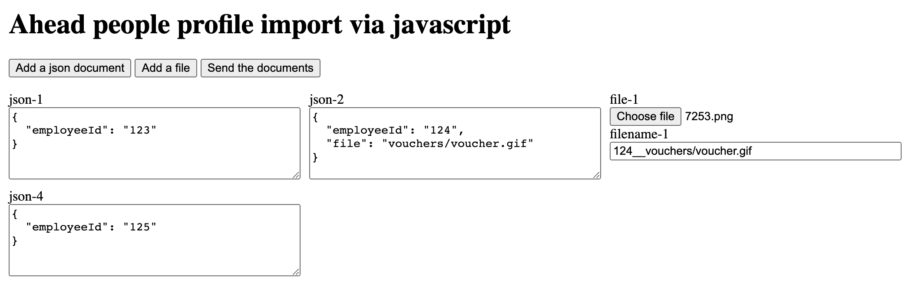

## dotnet / HTML sample

This sample shows am HTML page that allows creating a payload for an 
import request that is compatible with ahead's people import API. The server parses the request and performs
some basic validation around whether the sent json document(s) contain an employeeId. 

The special property "file" will be treated as an expected file that should follow the preceding JSON document. The server will do nothing but output some key data around your request.